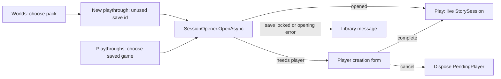

# Desktop Library and session opening

2026-09-08. Design for the first real desktop-client path into Play.

## Goal

Let a player choose an authored pack, choose a playthrough, answer the one
player-creation question where the pack does not author the protagonist, and
arrive in Play with a live `StorySession`. The Library owns navigation and forms;
App owns opening and Core owns the session, canon and mutations.

## Flow

The Library has separate **Worlds** and **Playthroughs** views. Worlds presents
pack names and author/version metadata from `world.json`; selecting a world can
only start a new playthrough. New playthrough requires an unused save identifier,
so it cannot silently resume an existing save. Playthroughs starts from saved
state: selecting a save shows its recorded world and resumes it. A save belongs to
exactly one pack, so ordinary save opening never asks the player to select a world.

Older saves without `save.json` provenance are an explicit exception. They appear
as legacy saves with no recorded world, and only then the Playthroughs view asks
the player to select the world they were created from. It labels that choice as
unverified instead of claiming an association that is not present on disk.

Opening visibly enters a busy state. If `SessionOpener` says the save is held, the
Library shows its human-readable reason and holder. Force-opening is excluded from
the first desktop flow: it is a recovery action with destructive consequences and
needs its own design. Errors from settings, pack loading or opening return to the
Library as messages without silently creating a different session.

For a pack without `player.md`, the player-creation form requires a name and
offers an optional description. Blank description preserves seeded text, exactly as
`PendingPlayer.CompleteAsync` defines. Cancelling or closing this form disposes the
pending object to release the save lock and provider client. Once completed, the
resulting `StorySession` owns those resources.

The Play screen receives the session and its `SessionContext`; it does not reopen
or reconstruct it. Switching back to Library or closing the window must dispose
the active session after any in-progress operation has reached an ordinary backend
outcome. The first integration does not send a turn yet.

## Desktop paths — decided: workspace folder

App correctly accepts explicit pack and save roots. The current CLI passes
repository-relative `worlds/` and `saves/`; this works for development but is not
a packaged-app location policy.

The player selects a workspace folder containing `worlds/` and `saves/`. The
selection is stored with desktop preferences, while the content and saves remain
in the selected workspace. This preserves the existing repository layout and
keeps authored content visible and portable.

The desktop app never derives these paths from its current directory. A workspace
without `worlds/` is rejected with an explanation; `saves/` is created when the
first new playthrough is opened. Packs are discovered from direct subdirectories
of `worlds/` using `WorldPack.Load` and their `world.json` metadata.

Saves with `save.json` only appear under the pack they record. Older saves that
predate provenance remain visible as **pack unknown**, so they can still be
opened deliberately without the UI inventing an association that is not on disk.

## Not in this slice

Manual-review refinements (2026-09-08): choosing a valid workspace persists it
immediately, including when Library is cancelled. The new-save identifier is
optional; blank generates world id plus local date/time with a collision suffix.
The Library window has a fixed size and each list scrolls independently.
Playthrough rows include turns, last saved time (canon file modification time),
and the recorded start date when available. Double-clicking a world starts a new
playthrough; double-clicking a save resumes it, or requests its missing legacy
world. Empty dropdown values are supported by the display template.

Real turn submission; history/opening rendering; retry,
reroll, Update State and canon editing; pack editing, importing or sharing;
narration-reference metadata; multiple open sessions and force-open recovery.
